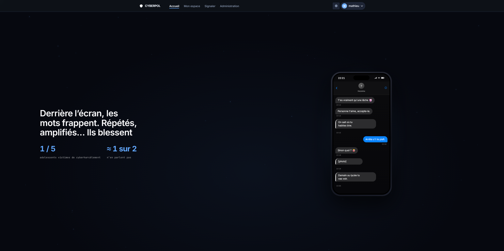
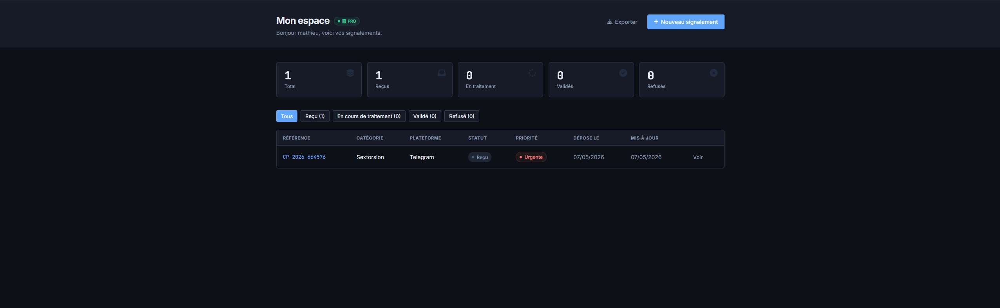
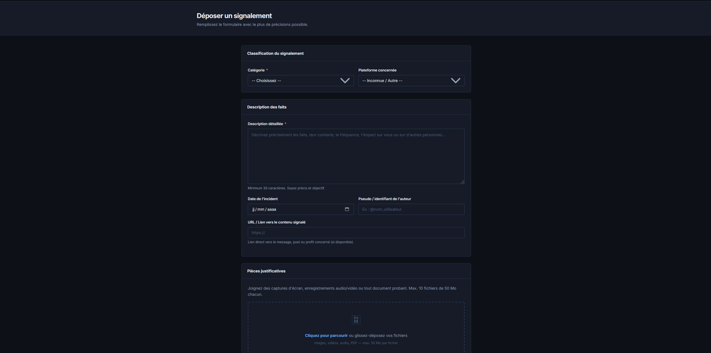

# CYBERPOL

**Plateforme de signalement de comportements malveillants en ligne.**

CYBERPOL permet aux victimes et témoins de cyberharcèlement de signaler des comportements malveillants de façon sécurisée, conforme au RGPD, et de suivre l'évolution de leurs signalements.

🌐 **[cyberpol-france.fr](https://cyberpol-france.fr)**

---

## Aperçu

  
  
  
---

## Fonctionnalités

- **Signalement** — Dépôt de signalements avec pièces jointes (images, vidéos, PDF)
- **Suivi** — Tableau de bord personnel pour suivre l'état de ses signalements
- **Espace admin** — Gestion et traitement des signalements par les modérateurs
- **Accès pro** — Espace dédié aux professionnels (associations, éducateurs...)
- **Sécurité** — Authentification, CSRF, chiffrement, conformité RGPD
- **Thème** — Mode clair / sombre

---

## Stack technique

| Couche | Technologie |
|---|---|
| Backend | PHP 8.x |
| Base de données | MySQL |
| Hébergement | Serveur dédié |

---

## Statut

---

## Contact

Pour toute question : [cyberpolfrance@gmail.com](mailto:cyberpolfrance@gmail.com)
